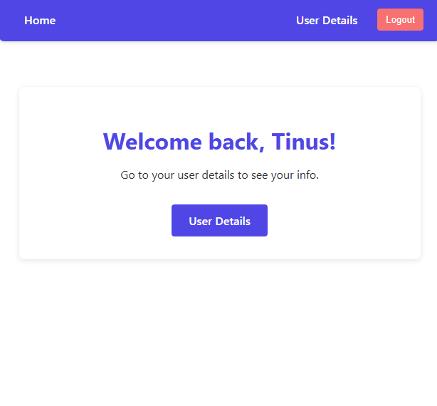
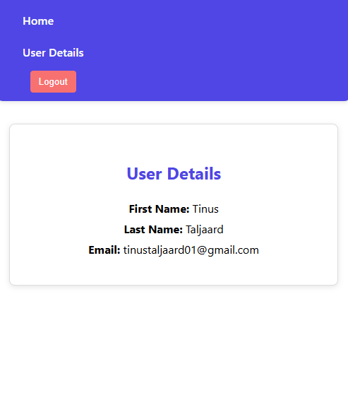

# Authenticator - Frontend

A React frontend application for user authentication that works with the **Authenticator Backend API**.  
Provides:

- User registration
- User login
- Viewing authenticated user details (first name, last name, email)

## Overview

This frontend interacts with the backend API, sending requests to:

- `/api/auth/register`
- `/api/auth/login`
- `/api/auth/me`

It automatically attaches JWT tokens to requests after login. The app runs on **http://localhost:3000** by default during development.

## Backend Integration

This frontend communicates with the **Authenticator – Backend API** for all user authentication and data retrieval.

- **Repository:** [Authenticator – Backend API](https://github.com/YOUR_USERNAME/authenticator-api)
- **Endpoints used:**
  - `POST /api/auth/register` – Register a new user
  - `POST /api/auth/login` – Log in a user
  - `GET /api/auth/me` – Retrieve current user details (requires JWT token)

**Note:** Ensure the backend API is running locally (default: `https://localhost:5000`) before using the frontend

## Prerequisites

- [Node.js 18+](https://nodejs.org/)
- [npm](https://www.npmjs.com/) (comes with Node.js)
- Backend API running locally (see [Authenticator Backend API](https://github.com/YOUR_USERNAME/authenticator-api) repository)

## Getting Started

1. Clone the repository:
git clone https://github.com/YOUR_USERNAME/authenticator-frontend.git
cd authenticator-frontend

2. Install dependencies:
npm install

3. Run the app in development mode:
npm start

Open http://localhost:3000 in your browser. The page reloads automatically when you make changes.

 API Configuration

The frontend expects the backend API to be running at:
https://localhost:5000/api

If your backend is running at a different URL or port, update the baseURL in src/api.js accordingly:
const api = axios.create({
  baseURL: "https://localhost:5000/api",
  headers: {
    "Content-Type": "application/json",
  },
});

Available Scripts

In the project directory, you can run:

npm start

Runs the app in development mode. Open http://localhost:3000
 to view it in your browser. Hot reloads on changes.

npm test

Launches the test runner in interactive watch mode.

npm run build

Builds the app for production in the build folder. Bundles React for optimized performance.

npm run eject

Removes the build dependency and exposes the full configuration. This is a one-way operation.

Learn More

React documentation

Create React App documentation

Axios documentation

Project Structure
src/
├─ api.js            # Axios instance with JWT interceptor
├─ App.js            # Main app routing and state
├─ pages/            # Register, Login, UserDetails, Home pages
├─ components/       # NavBar, reusable components
└─ ...
License

MIT License

## Screenshots

### Login Page

### Home Page (After Login)

### User Details Page

